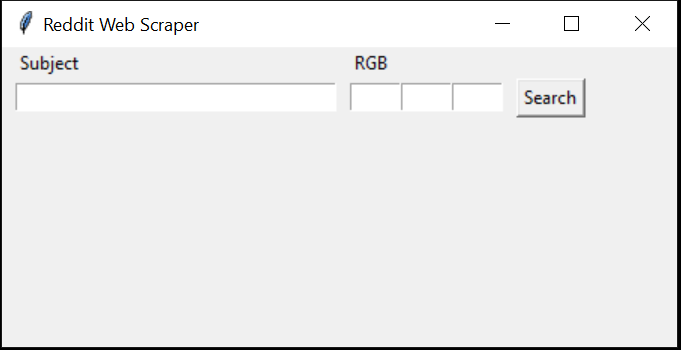

# Python_Reddit_Scraper

Python scraper that can find the most popular images on Reddit with a particular dominant colour.

•	Marketers know the best way to sell things is to get great images that tie in with their brand. And everyone wants the best viral images and videos.

•	The marketers also need to match certain colours to tie in well with their brand values.

•	One place where images and videos are clearly sorted by popularity for sharing is reddit.
So, you need to build a service that can find the most popular images or videos on reddit with a particular dominant colour.

The application:

•	Receives input from the caller as a colour (in R,G,B values) and a subject.

•	Scrapes reddit for the most shared images related to that subject with the specified colour, or a similar one, being dominant.

•	Outputs links to the top three images from reddit with that dominant colour, with the ranking being determined by the number of comments on the post with that image in it.

###### User Guide
To succesfully run the application please read the <a href="docs/user_guide.md" target="_blank"> user guide</a>.

###### Basic Settings
Some parameters can be custumised to improve the result quality and the execution time, a complete list can be found at:<a href="docs/basic_settings.md" target="_blank"> basic settings</a>.

###### Future developments:

•	Insert an "Advance Settings" options where the user can change:

        • The color thresholder
        
        • The top N number of color in the image to consider
        
        • Max number of threads that can be executed concurrenly
        
        • Limit for the Reddit request
        
        • Display the image close to the url
        
        • Display the number of comments and the score of the original post
        
        
        
