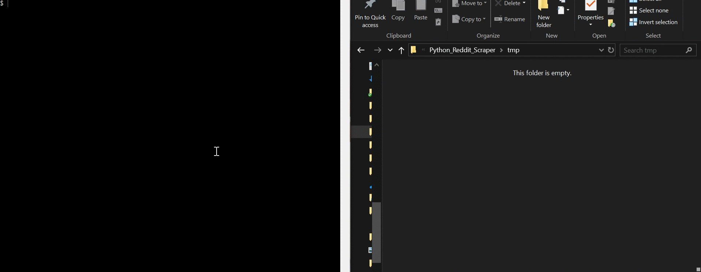

# User Guide

To execute the Python scraper and find the 3 most popular images on Reddit with a particular dominant colour:

• Execute the main.py

• Once the UI is displayed, insert a subject and the RGB color. Please note that the subject needs to be long at least a character, while each RGB value needs to be in the range (0, 255). In case these conditions are not satified, after pressing the button "Search" an error message will be displayed.

• The application will return the top 3 images related to the topic, matching the color and sorted by the number of comments to the related post. Please note that the script can take several minutes (depending from query) and can return fewer images in case was not possible find 3 images satisfying the requirements. A local copy of the images can be found in the /tmp directory and will be stored until the script will be re-executed.

 
